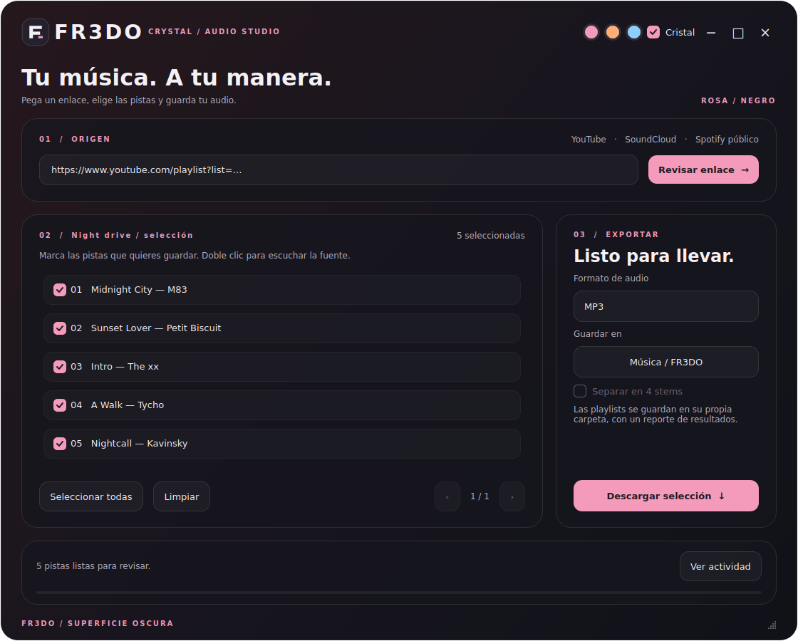

# FR3DO · Crystal

Descarga audio de canciones y playlists de **YouTube y SoundCloud**, e importa canciones, álbumes y playlists públicas de **Spotify**, buscando versiones de audio en YouTube.



*Captura real de la interfaz con una lista de demostración. En esta captura se usa el fondo oscuro de compatibilidad; el escritorio desenfocado se activa en Windows.*

## Interfaz

- Marca FR3DO, monograma F y superficies redondeadas.
- Paletas **rosa + negro**, **naranjo + negro** y **celeste + negro**, desde los tres círculos de la barra superior. La elección queda guardada.
- Interruptor **Cristal**: usa Acrylic nativo para ver el escritorio desenfocado en Windows 10 (1809+) y Windows 11. La disponibilidad depende del compositor y las opciones visuales de Windows. Si no está disponible, se conserva una superficie oscura legible. Windows 11 también permite esquinas nativas redondeadas.
- Sin animaciones continuas ni filtros calculados por la aplicación. El trabajo de descarga corre fuera del hilo de la interfaz.

## Instalar desde código

Recomendado: Python 3.11 de 64 bits y FFmpeg y Deno en `PATH`. Descarga el repositorio completo, incluyendo `assets/`.

En PowerShell, desde la carpeta del proyecto:

```powershell
py -3.11 -m venv .venv
.\.venv\Scripts\Activate.ps1
python -m pip install --upgrade pip
python -m pip install -r requirements.txt
python main.py
```

Si Windows bloquea la activación del entorno, usa directamente:

```powershell
.\.venv\Scripts\python.exe -m pip install -r requirements.txt
.\.venv\Scripts\python.exe main.py
```

Para instalar FFmpeg y el motor JavaScript que utiliza yt-dlp con YouTube:

```powershell
winget install --id Gyan.FFmpeg --exact
winget install --id DenoLand.Deno --exact
```

Abre una nueva terminal y comprueba `ffmpeg -version` y `deno --version`. Reinicia FR3DO después de instalarlo.

Qt también puede ejecutarse en Linux/macOS con un escritorio compatible; el desenfoque nativo de esta versión se implementa únicamente para Windows.

## Uso

1. Pega un enlace de YouTube, SoundCloud o Spotify público y pulsa **Revisar enlace**.
2. Selecciona las pistas. Un doble clic abre la fuente para escucharla antes de descargar.
3. Elige MP3, WAV o FLAC, y la carpeta de destino.
4. Pulsa **Descargar selección**. **Ver actividad** muestra los detalles y errores.

Las listas grandes tienen páginas de 50 pistas y conservan la selección. Las playlists se guardan en una carpeta propia. No se sobrescriben archivos anteriores; si una pista falla, el lote continúa. `fr3do-resultados.json` guarda el resultado de cada pista. Convertir a MP3 de 320 kbps, WAV o FLAC no aumenta la calidad de la fuente.

## Spotify público, sin Client ID

Esta versión no pide Client ID, Client Secret, cookies ni inicio de sesión. Usa **SpotipyFree** para consultar metadatos públicos. No hace falta crear una aplicación en el panel de Spotify.

**El audio viene de YouTube, no de Spotify.** La lista muestra el título encontrado y el original de Spotify. Las coincidencias empiezan desmarcadas para que revises y elijas versiones; la búsqueda no garantiza que sean la misma grabación.

Admite enlaces `https://open.spotify.com/playlist/...`, `/album/...` y `/track/...`. Las listas privadas, pistas locales y episodios quedan fuera de este modo. El proveedor público es experimental y puede cambiar, bloquear solicitudes o dejar de responder: no se garantiza disponibilidad permanente ni ilimitada. Un fallo de Spotify no impide revisar enlaces de YouTube o SoundCloud.

## Separar instrumentos (opcional)

La instalación básica no incluye PyTorch/Demucs. Para activar **Separar en 4 stems** al ejecutar desde Python:

```powershell
python -m pip install -r requirements-stems.txt
python main.py
```

Demucs necesita más espacio, memoria y tiempo de procesamiento; 8 GB de RAM es una referencia práctica para uso en CPU. La primera ejecución descarga su modelo. Crea voces, batería, bajo y otros en WAV. Si termina correctamente, elimina el audio intermedio. La edición ejecutable básica no incluye esta función.

## Ejecutable para Windows

El workflow **Windows build** comprueba la aplicación, genera `FR3DO-Windows.zip` con PyInstaller y publica la versión `v0.2.0` al integrarse en `main`. El ejecutable necesita FFmpeg y Deno en `PATH`; no necesita instalar Python. Descomprime toda la carpeta y abre `FR3DO.exe`. Un binario sin firma puede activar avisos de Windows.

## Validación

```powershell
python -m unittest discover -s tests -v
```

Las pruebas verifican selección, paginación, cambios de enlace, opciones de exportación, errores de fuentes, fallos parciales y archivos sin sobrescritura. Usan fuentes simuladas: no verifican la disponibilidad permanente de servicios externos. La apariencia nativa Acrylic debe comprobarse en Windows.

## Dependencias

- [PySide6 / Qt](https://doc.qt.io/qtforpython-6/): interfaz.
- [yt-dlp](https://github.com/yt-dlp/yt-dlp): fuentes de audio.
- [SpotipyFree](https://github.com/TzurSoffer/spotipyFree): metadatos públicos de Spotify.
- [FFmpeg](https://ffmpeg.org/): conversión.
- [Deno](https://docs.deno.com/runtime/getting_started/installation/): motor JavaScript para los desafíos de YouTube ([yt-dlp EJS](https://github.com/yt-dlp/yt-dlp/wiki/EJS)).
- [Demucs](https://github.com/facebookresearch/demucs): separación opcional.

Usa contenido propio o para el que tengas autorización.
